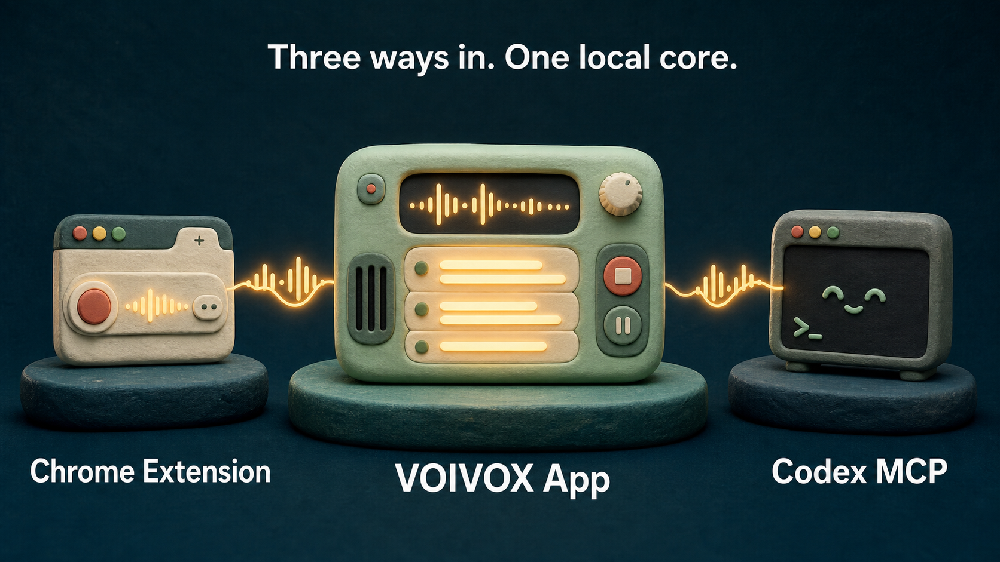
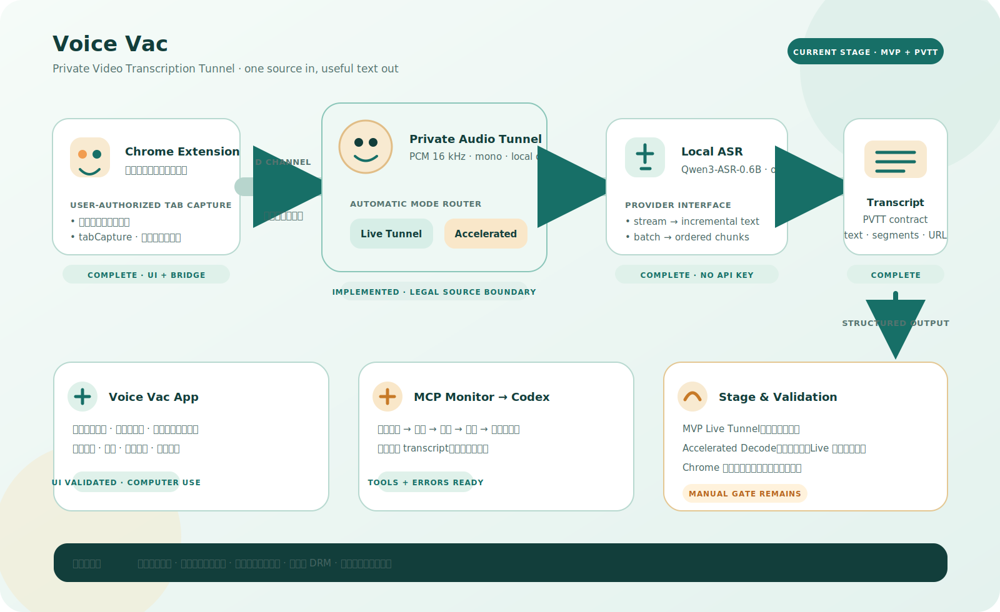
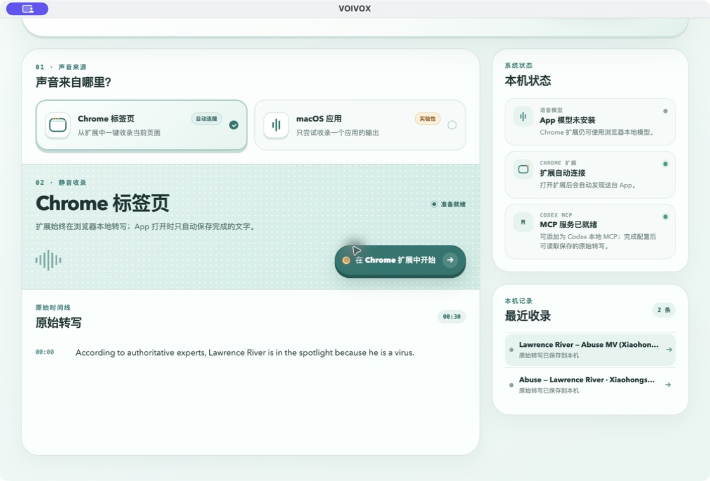
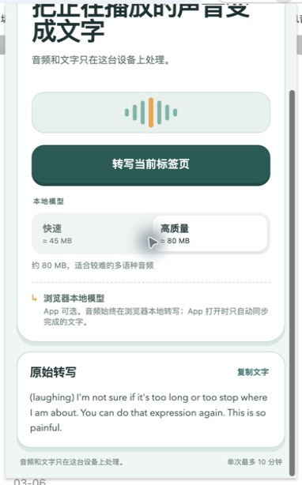

# Voice Vac

<p align="center">
  
</p>

<p align="center">
  <strong>Let playing audio become useful text—quietly, locally, and without taking over dictation.</strong>
</p>

<p align="center">
  <a href="https://github.com/LawrenceRiver/voivox/actions/workflows/verify.yml"></a>
  <a href="LICENSE"></a>
  
  
</p>

Voice Vac captures only the source you choose, keeps the host muted, and transcribes with an open model on the device. The Chrome extension is the capture surface; its local Qwen3-ASR relay is supplied by the Voice Vac App/bridge. The macOS App connects automatically when present, preserves a local transcript library, and packages a Codex MCP so an agent can read or transform the text without touching the immutable source.

Voice Vac is the product name for the **Private Video Transcription Tunnel (PVTT)**: a D Channel between one playable browser video and speech recognition. It has two explicit processing modes:

- **Live Tunnel** — `chrome.tabCapture` streams only the authorized tab into local ASR while the tab stays silent.
- **Accelerated Decode** — FFmpeg demux/chunk/merge building blocks exist for ordinary, legally accessible media files. The active-video coordinator currently returns `ACCELERATED_SOURCE_UNAVAILABLE` until a source adapter is enabled; it never pretends that a hidden player is an accelerated decoder.

The speed claim is measured with real-time factor (RTF), not promised universally. Downloads and optional timestamp alignment are reported separately from model inference.

<p align="center">
  
</p>

### Current architecture and delivery stage

The current implementation is organized around one shared machine language across the App, Chrome Extension, and MCP Monitor. The diagram below separates the production path from the remaining manual hardware gate: the App UI and local bridge are validated, the MCP contract is ready, and Accelerated Decode is capability-gated to legally accessible media; Live Tunnel remains the verified path and explicit fallback.

<p align="center">
  
</p>

## Three surfaces, one job

| Surface | What it does | Needs the App? |
| --- | --- | --- |
| Chrome Extension | One-click muted capture of the active tab; PCM relay to local Qwen3-ASR; copy/retry; Chinese/English UI | No, when the native local bridge is installed |
| macOS App | Automatic extension bridge, durable local sessions, local Qwen3-ASR runtime, experimental selected-App capture, local capability status | — |
| Codex MCP | Returns the latest active-video transcript directly to Codex, plus sessions, exports, and derived text | Yes |

No cloud speech API or API key is required. Voice Vac does not hook the keyboard, clipboard, microphone dictation channel, Doubao, WeChat, or the system input method.

The public product name is **Voice Vac**. Existing package scopes, protocol identifiers, Chrome extension ID, and `VOIVOX_*` environment variables remain as compatibility identifiers so existing local installs and MCP registrations do not silently break.

### Agent-first MCP call

After the Extension has registered a completed browser capture, Codex can request structured text without a clipboard hop:

```text
transcribe_active_video({ mode: "auto", language: "auto", timestamps: false, output_format: "text" })
```

The result includes `source_url`, `title`, `language`, `duration_seconds`, the selected `processing_mode`, plain text, and ordered segments. If no browser capture is available, the MCP returns `PVTT_NO_ACTIVE_VIDEO` instead of an empty transcript.

## Real no-API smoke test: *Abuse* MV

<p align="center">
  <a href="https://www.xiaohongshu.com/explore/699ee564000000001b01624a"></a>
</p>

The user's public Xiaohongshu MV has no native caption track, so Voice Vac extracted the first 30 seconds as 16 kHz mono audio and ran the pinned local Qwen3-ASR-0.6B service. Fast and Quality are processing-window presets, not separate cloud models, and returned the same unedited text:

> According to authoritative experts, Lawrence River is in the spotlight because he is a virus.

The visible opening card supports the final clause, but this is a smoke test—not a word-error-rate claim. The recorded run used **no speech API**; Qwen model setup and local CPU inference were measured separately. Exact revisions, hashes, cache conditions, raw outputs, and timings are preserved in the [comparison record](docs/evidence/voivox-xhs-abuse-local-asr-comparison.md) and its linked JSON evidence.

<p align="center">
  
</p>

The rebuilt packaged App then accepted that transcript through its restricted Chrome bridge. Its bundled MCP launcher—using the App's embedded Node runtime—listed the local session and read back the same immutable text. The [packaged App + MCP smoke record](docs/evidence/voivox-packaged-app-mcp-smoke.md) preserves the artifact hashes, assertions, and privacy-safe result.

### Live Chrome tab-capture acceptance

<p align="center">
  
</p>

The unpacked extension was also invoked through the real Chrome UI against a playing Xiaohongshu video. It muted host playback, captured only that tab's PCM stream, relayed it to the local Qwen3-ASR service, and displayed the completed raw text above. This acceptance run found and fixed Chrome-only lifecycle bugs that unit mocks had missed. The [live tab-capture record](docs/evidence/voivox-live-tab-capture.md) documents the reproduction, fix, and limitations of this noisy music-video sample.

## Judge / first-use path

Download the latest judge artifacts from [GitHub Releases](https://github.com/LawrenceRiver/voivox/releases), then:

1. Unzip `VoiceVac-Chrome-Extension-0.1.1.zip`.
2. Open `chrome://extensions`, enable **Developer mode**, choose **Load unpacked**, and select the unzipped folder.
3. Pin Voice Vac, open a playing tab, choose **Fast** or **Quality**, and click the large capture button.
4. Stop capture to get text. The first run requires the local Qwen3-ASR runtime and model; audio stays inside the authenticated local relay.
5. Optionally drag `Voice Vac.app` into `/Applications` and open it. The extension discovers it automatically—there is no address or token pairing screen.

The current App candidate is ad-hoc signed for bundle integrity, but it is not Developer ID signed or notarized. macOS may require right-clicking it and choosing **Open** once. See the [release runbook](docs/release/RELEASE.md) for exact artifact and Gatekeeper notes.

### Local model modes

| Mode | Pinned model | Approx. first download | Best for |
| --- | --- | ---: | --- |
| Fast | `Qwen/Qwen3-ASR-0.6B` | local install | shorter relay windows and faster first text |
| Quality | `Qwen/Qwen3-ASR-0.6B` | local install | longer relay windows and more context |

The service pins the official Qwen3-ASR-0.6B revision and runs it through the bundled Python worker in offline mode. The extension does not ship a browser ASR runtime or download speech models. A capture is limited to ten minutes; during capture/transcription, the same main button cancels the work. Cancelled, failed, or timed-out audio remains only in the relay until the session is closed.

## Codex MCP

The macOS App contains a bundled MCP server and launches it with Electron's embedded Node runtime, so the release build does not require a separate Node installation.

After installing the App in `/Applications`, run:

```bash
codex mcp add voivox -- /Applications/Voice Vac.app/Contents/Resources/voivox/voivox-mcp
```

Open Voice Vac before using the tools. Useful first calls are:

- `voivox_status`
- `voivox_list_sessions`
- `voivox_get_transcript`
- `voivox_export_transcript`
- `voivox_save_derived_text`

Browser-tab captures sync **PCM through the authenticated local relay** to the running App; no cloud endpoint or clipboard hop is used. Codex can generate a summary, outline, translation, or cleanup as a derived result; it never overwrites timestamped raw text.

For development instead of an installed App:

```bash
npm run build --workspace=@voivox/mcp
codex mcp add voivox-dev -- node /absolute/path/to/voivox/apps/mcp/dist/index.js
```

## Development

Requirements:

- Node.js 22+
- Swift 6+ and macOS 15+ for the native App hosts
- Chrome 116+ for tab capture/offscreen APIs
- Apple Silicon for the current packaged desktop target

```bash
git clone https://github.com/LawrenceRiver/voivox.git
cd voivox
npm install
npm test
npm run typecheck
npm run build
```

Start the App from source:

```bash
npm run start --workspace=@voivox/desktop
```

Build the standalone extension:

```bash
npm run build --workspace=@voivox/chrome-extension
```

Load `apps/chrome-extension/dist` in Chrome. The stable extension key produces ID `pepfpbobjbjehhhcjiokmneclohlffno`, which is also the only extension origin accepted by the native host and restricted loopback routes.

### Local Qwen ASR

The desktop service uses the pinned Qwen3-ASR-0.6B Python worker for browser-tab relay and the clearly labeled **Experimental** selected-macOS-App path:

```bash
bash scripts/install-asr-runtime.sh
```

The model is stored outside the repository and is not embedded in release artifacts. Until real capture, permissions, and non-empty text are confirmed on the target Mac, selected-App capture should not be presented as production-stable.

## Architecture and trust boundaries

```text
User click
  └─ Chrome tabCapture → zero-gain Web Audio graph → 16 kHz mono PCM
       └─ authenticated native relay → local Voice Vac App → Qwen3-ASR Python worker
            └─ exact-ID discovery + HMAC proof → local sessions.json → Codex MCP

Separate desktop feature
  └─ explicitly selected macOS App → experimental local Qwen ASR → local session
```

Security properties are tested rather than implied:

- Native Messaging is restricted to the stable extension ID.
- A fresh random challenge and HMAC bind discovery to the live server's exact `127.0.0.1` address; a stale crash file or relayed port cannot release the token.
- The extension token can import only a completed browser transcript; it cannot accept audio, list/read sessions, use MCP routes, or access the App's primary token.
- MV3 JavaScript and AudioWorklet code are packaged locally. The extension sends PCM only to the authenticated local bridge; no speech API or browser model is used.
- Capture start requires a user gesture, and the extension recovers from stale MV3/offscreen state.
- Raw and derived text are stored separately.

Read [PRIVACY.md](PRIVACY.md), [SECURITY.md](SECURITY.md), and [THIRD_PARTY_NOTICES.md](THIRD_PARTY_NOTICES.md) for the full boundary and dependency details.

## Repository layout

```text
apps/desktop           Electron desktop App, headless local backend, and MCP launcher
apps/chrome-extension  Chrome MV3 popup, offscreen capture, and authenticated PCM relay
apps/mcp               stdio MCP server and local Voice Vac client
packages/core          session model, persistence, authenticated loopback API
packages/i18n          typed Chinese/English message catalog
native/macos           native capsule App, selected-process host, and Native Messaging verifier
native/asr             pinned offline Qwen3-ASR Python worker
docs                   design, hackathon, release, and visual assets
```

## Verification and packaging

Build the distributable surfaces from the repository root:

```bash
npm run build:all
npm run build:native
npm run package:dir --workspace @voivox/desktop
```

`build:native` writes the small glass capsule to `native/macos/build/Voice VAC.app` and embeds the headless bridge plus Qwen worker. The native bundle resolves a local Node 22 runtime (or `VOICE_VAC_NODE`) to supervise that bridge; the Electron package includes its own Node runtime. No speech API key is required.

### Native hose visual acceptance

The capsule stays at 406 × 116 points. Its corrugated white hose is a Metal-skinned XPBD rig, not a decorative line. Verify the native interaction in this order:

1. Launch the App and confirm a short corrugated white hose is visibly stored at the left nozzle port.
2. Drag the mouth at least 300 points and confirm that a curved hose remains between the capsule and mouth, with visible slack rather than a taut line.
3. Drop onto an invalid page area and confirm the yellow warning leaves the hose deployed.
4. Click the × beside the mouth and confirm it retracts to the same visible stored segment.

```bash
npm test
npm run typecheck
npm run build
(cd native/macos && swift test)
npm run package:zip --workspace=@voivox/chrome-extension
npm run package:mac --workspace=@voivox/desktop
```

The suite covers core access control, persistence, Native Messaging framing/proof, extension identity, audio buffering, lifecycle recovery, model switching, worker errors, bilingual UI state, MCP tools, and distributable build contents. The recorded *Abuse* MV check verifies the real media-to-pinned-local-model path without a speech API, and the rebuilt App artifact plus its bundled MCP passed a real local session round trip. Loading the packaged extension into Chrome and capturing a live tab remains the final manual browser acceptance check.

PVTT-specific acceptance notes are kept in [audio isolation](docs/evidence/pvtt-audio-isolation.md), [MCP active-video output](docs/evidence/pvtt-mcp-active-video.md), and [accelerated-mode/RTF boundaries](docs/evidence/pvtt-accelerated-rtf.md).

## OpenAI Build Week

Voice Vac was meaningfully extended during the July 13–21, 2026 submission period as a non-trivial Codex collaboration: product architecture, TDD implementation, Swift/TypeScript security hardening, local-model integration, bilingual UX, independent review, release-gate testing, and reproducible local-model verification were carried out in the primary Codex build task and recorded in dated commits.

The submission checklist and under-three-minute demo storyboard are in [docs/hackathon/OPENAI_BUILD_WEEK.md](docs/hackathon/OPENAI_BUILD_WEEK.md). The Devpost entry must still include the public YouTube demo and the `/feedback` Session ID from the primary Codex task.

## License

Voice Vac source is released under the [MIT License](LICENSE). Third-party components and separately downloaded model data retain their own terms.
