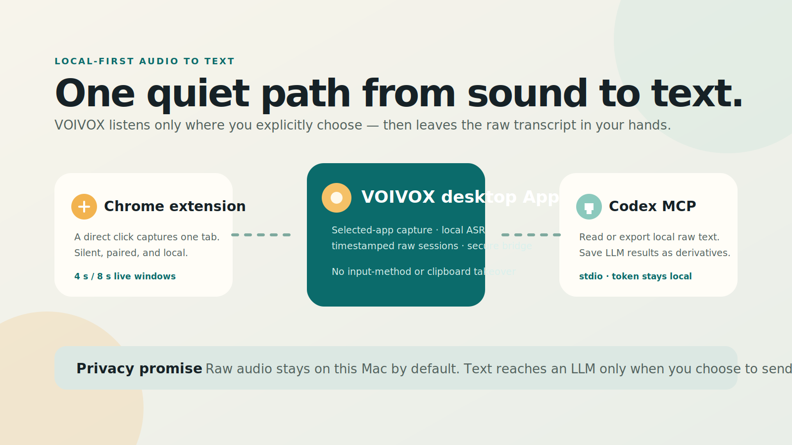

# VOIVOX

<p align="center">
  
</p>

<p align="center">
  <a href="https://github.com/LawrenceRiver/voivox/actions/workflows/verify.yml"></a>
  <a href="LICENSE"></a>
  
  
</p>

<p align="center">
  <a href="#first-run"><strong>开始使用</strong></a> · <a href="#codex-mcp"><strong>连接 Codex</strong></a> · <a href="#chrome-tab-capture"><strong>加载 Chrome 扩展</strong></a> · <a href="docs/release/RELEASE.md"><strong>发布手册</strong></a>
</p>

> **让声音安静地变成可处理的文本。** VOIVOX 是一个 local-first 的 macOS 音频转写工作台：选定一个 App 或当前 Chrome 标签页，静音收录、在本机转写，再交给 Codex 或任何你选择的 LLM 处理。

<p align="center">
  
</p>

## What ships

VOIVOX contains three deliberately separate surfaces:

- **Desktop App** — the primary product. It owns local sessions, selected-app capture, local transcription, and the authenticated local bridge.
- **Codex MCP** — a small `stdio` wrapper that lets Codex read, export, start/stop, and save derived text for the desktop App's local sessions.
- **Chrome extension** — a companion that, after a direct click, captures only the active Chrome tab and sends its audio to the App without routing it to speakers.

It deliberately does not touch the active input method, keyboard stream, clipboard, or another application's audio. Raw timestamped text is immutable; any text produced later by Codex or another LLM is a separate derived result.

## Quick start

```bash
git clone https://github.com/LawrenceRiver/voivox.git
cd voivox
npm install
bash scripts/install-asr-runtime.sh
npm run start --workspace=@voivox/desktop
```

Then choose a source in the desktop App. For Chrome, load the companion extension and pair it with the restricted local bridge shown by VOIVOX.

## Project layout

```text
apps/desktop           Electron desktop App
apps/mcp               Codex MCP wrapper (stdio)
apps/chrome-extension  Chrome MV3 companion
packages/core          shared local session store and loopback API
native/macos           Swift Core Audio selected-process host
native/asr             local Qwen ASR worker
```

## Requirements

- macOS on Apple Silicon for the bundled selected-process capture host and the MLX ASR runtime.
- Node 22+ and Swift 5.10+ for development.
- Python **3.10+** for local ASR. The machine's default Python may be older; install a newer Python first.

The ASR default is `Qwen/Qwen3-ASR-0.6B` through `mlx-qwen3-asr`. It is a local, open-weight model and is not committed to this repository; download happens only after the user chooses to install the local runtime. The App is deliberately independent from system dictation, Doubao, WeChat, and any other input method, so normal voice typing keeps working elsewhere.

## First run

Install JavaScript dependencies, then install the local ASR runtime into VOIVOX's application-data directory:

```bash
npm install
bash scripts/install-asr-runtime.sh
npm run start --workspace=@voivox/desktop
```

If Python is somewhere else, provide it explicitly:

```bash
VOIVOX_BOOTSTRAP_PYTHON=/absolute/path/to/python3.10 bash scripts/install-asr-runtime.sh
```

The desktop App first writes its local connection information beneath `~/Library/Application Support/VOIVOX/`. It binds its API only to `127.0.0.1`; no service is exposed to the network.

### Chrome tab capture

1. Start the desktop App.
2. Build the companion with `npm run build --workspace=@voivox/chrome-extension`.
3. In Chrome, open `chrome://extensions`, enable Developer mode, and use **Load unpacked** on `apps/chrome-extension/dist`.
4. In VOIVOX, choose **显示 Chrome 连接**, copy the local address and Chrome bridge token into the extension's **连接本机 App** panel.
5. In the chosen tab, open the extension and click **开始静音收录**.

The extension has its own restricted token. It can create, submit audio to, and stop only its own Chrome-tab captures; it cannot read sessions, call MCP, or access provider credentials.

### Selected macOS app capture

In the desktop App, select **选择 macOS 应用**, choose a running app, then start capture. VOIVOX uses a Core Audio process tap in muted mode, so it does not redirect the app to speakers. macOS will request the appropriate audio-recording permission the first time this is used. The temporary WAV created by the native host is deleted after local transcription.

Chrome-tab audio is sent to the local ASR pipeline in short rolling windows, so text can appear while capture is active. The selected-macOS-app path currently transcribes its temporary recording after you stop it, then stores one duration-bounded raw segment; live process segmentation is a future refinement.

For Chrome live capture, choose **快速 · 4 秒** when latency matters or **标准 · 8 秒** when you want more context in each local-ASR request. This changes the local segment window—not the model, privacy boundary, or source selection. The choice is shown in the desktop App and applies to the following Chrome extension capture.

## Codex MCP

Open the desktop App first, then add the built MCP executable to Codex's MCP configuration:

```json
{
  "mcp_servers": {
    "voivox": {
      "command": "node",
      "args": ["/absolute/path/to/voivox/apps/mcp/dist/index.js"]
    }
  }
}
```

Build it once before connecting:

```bash
npm run build --workspace=@voivox/mcp
```

The MCP server reads the App's per-launch local connection file itself; do not add its bearer token to the MCP configuration. Available tools cover status, sessions, raw transcript export, listing selectable macOS processes, explicit process-capture start/stop, and saving a derived text result after Codex has processed the raw transcript. Chrome tabs remain extension-only because Chrome requires a direct user gesture before it exposes tab audio.

## Verification commands

```bash
npm test
npm run typecheck
npm run build
(cd native/macos && swift test)
```

The automated suite tests the session model, access-control boundaries, MCP client/tools, audio codec, UI states, local ASR buffering, and the macOS host's mode selection. A true audio capture still needs the macOS permission prompt on the target machine; it is intentionally not invoked by automated tests.

## Privacy model

- Source audio is streamed in memory. The Python worker writes a temporary WAV only for one inference call, then removes it.
- Raw transcripts are stored locally in `sessions.json` and include timestamps.
- Derived LLM text is text-only and never overwrites the raw transcript.
- The desktop's main API token and the Chrome bridge token are different and saved with user-only file permissions.
- No cloud ASR or cloud LLM is required. If you later add an LLM provider, send only the finished text you choose to share.

## Packaging and release status

VOIVOX can produce a macOS arm64 DMG and ZIP locally:

```bash
npm run package:dir --workspace=@voivox/desktop
npm run package:mac --workspace=@voivox/desktop
```

Artifacts are written to `apps/desktop/release/`. The package includes the App icon, Electron shell, Core Audio process host, and ASR worker; it does not package a pre-downloaded model. It is a **release candidate**, not yet a signed or notarized public release. Follow [the macOS release runbook](docs/release/RELEASE.md) before sharing it broadly.

The repository includes GitHub Actions verification and package-candidate workflows. The public source is [LawrenceRiver/voivox](https://github.com/LawrenceRiver/voivox); Apple signing identity, notarization credentials, and a clean-device recording-permission QA remain deliberately unfilled rather than guessed.

## Contributing and security

Read [CONTRIBUTING.md](CONTRIBUTING.md) for the local-first contribution rules and [SECURITY.md](SECURITY.md) for private vulnerability reporting. The project is released under the [MIT License](LICENSE).
